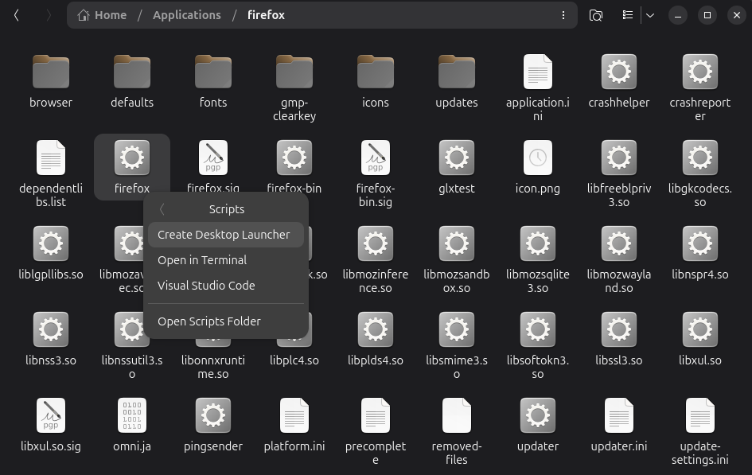

# Liftoff

Easily create `.desktop` application launchers for your Linux desktop environment with Liftoff.


## Installation

### From Flathub (recommended)

```bash
flatpak install flathub lv.martinsz.Liftoff
```

## Usage

This is most useful when used as Nautilus script.


